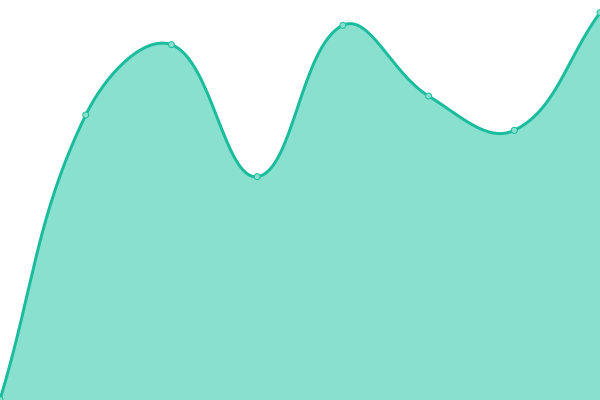
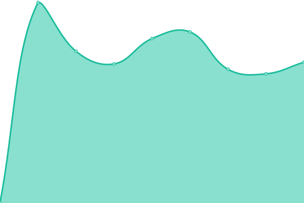
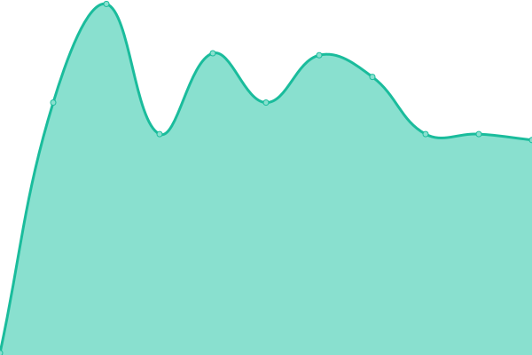

# [📈 Live Status](https://status.mimedev.fr): <!--live status--> **Tout est opérationnel**

This repository contains the open-source uptime monitor and status page for [Mime](https://www.mimedev.fr), powered by [Upptime](https://github.com/upptime/upptime).

With [Upptime](https://upptime.js.org), you can get your own unlimited and free uptime monitor and status page, powered entirely by a GitHub repository. We use [Issues](https://github.com/Mimexe/status/issues) as incident reports, [Actions](https://github.com/Mimexe/status/actions) as uptime monitors, and [Pages](https://status.mimedev.fr) for the status page.

<!--start: status pages-->
<!-- This summary is generated by Upptime (https://github.com/upptime/upptime) -->
<!-- Do not edit this manually, your changes will be overwritten -->
<!-- prettier-ignore -->
| URL | Status | History | Response Time | Uptime |
| --- | ------ | ------- | ------------- | ------ |
|  [mimedev.fr](https://mimedev.fr) | En ligne | [mimedev-fr.yml](https://github.com/Mimexe/status/commits/HEAD/history/mimedev-fr.yml) | 

 961ms
     
 | 

<a href="https://status.mimedev.fr/history/mimedev-fr">100.00%</a>
    

|  [MimeHeberg](https://panel.mimedev.fr) | En ligne | [mime-heberg.yml](https://github.com/Mimexe/status/commits/HEAD/history/mime-heberg.yml) | 

 613ms
     
 | 

<a href="https://status.mimedev.fr/history/mime-heberg">100.00%</a>
    

|  [MimeHeberg Node](node.mimedev.fr) | En ligne | [mime-heberg-node.yml](https://github.com/Mimexe/status/commits/HEAD/history/mime-heberg-node.yml) | 

 138ms
     
 | 

<a href="https://status.mimedev.fr/history/mime-heberg-node">100.00%</a>
    

|  [Commandes](mc.mimedev.fr) | En ligne | [commandes.yml](https://github.com/Mimexe/status/commits/HEAD/history/commandes.yml) | 

 136ms
     
 | 

<a href="https://status.mimedev.fr/history/commandes">50.27%</a>
    

<!--end: status pages-->

[**Visit our status website →**](https://status.mimedev.fr)

## 📄 License

- Powered by: [Upptime](https://github.com/upptime/upptime)
- Code: [MIT](./LICENSE) © [Anand Chowdhary](https://anandchowdhary.com), supported by [Pabio](https://pabio.com)
- Data in the `./history` directory: [Open Database License](https://opendatacommons.org/licenses/odbl/1-0/)
